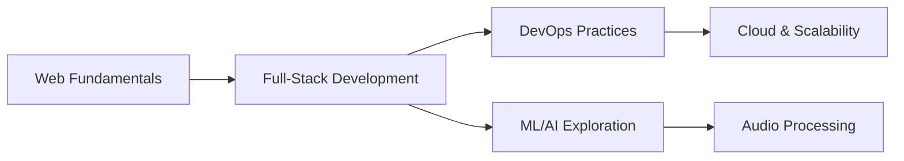

<div align="center">
  
# 👋 Hey there! I'm Charan Teja

### Full-Stack Developer | DevOps Enthusiast | Problem Solver


[](https://www.linkedin.com/in/charan-teja-rathikindi/)
[](http://charanteja-6825.github.io/MacOS/)
[](mailto:rcharanteja2006@gmail.com)

</div>

---

## 🚀 About Me

> *"Code is like humor. When you have to explain it, it's bad."* – Cory House

I'm a passionate developer who loves turning complex problems into elegant solutions. With a strong foundation in **full-stack development** and a keen interest in **DevOps practices**, I build applications that are not just functional, but scalable and maintainable.

- 🔭 Currently working on **enterprise-grade full-stack applications**
- 🌱 Diving deep into **Docker, Jenkins, and CI/CD pipelines**
- 🎯 Exploring **audio processing and ML/AI applications**
- 💡 Always experimenting with **modern web technologies**
- ⚡ Fun fact: I believe good code is its own documentation

---

## 🛠️ Tech Arsenal

<div align="center">

### 💻 Frontend Development


### ⚙️ Backend Development

 


### 🔧 DevOps & Tools


### 🗄️ Databases


</div>

---

## 🎯 Featured Projects

<div align="center">

<table>
<tr>
<td width="50%">

### 🚗 DriveAway
**A Smooth Operating Car Rental System**

```text
Tech Stack: React • Java • MySQL
Focus: Full-Stack Development
```

A comprehensive car rental platform with seamless user experience, robust backend architecture, and real-time booking management.

[](https://github.com/CharanTeja-6825/DRIVEAWAY)

</td>
<td width="50%">

### 🔄 CI/CD DevOps Pipeline
**Automated Deployment Workflows**

```text
Tech Stack: Docker • Jenkins • GitHub Actions
Focus: DevOps & Automation
```

Enterprise-level CI/CD implementation with Docker containerization, automated testing, and seamless deployment strategies.

[](https://github.com/CharanTeja-6825/GIT-ACTIONS-DOCKER-SDP-DEVOPS)

</td>
</tr>

<tr>
<td width="50%">

### 🐳 Docker DevOps
**Containerization at Scale**

```text
Tech Stack: Docker • React • Java
Focus: Containerization
```

Dockerized full-stack application demonstrating microservices architecture, container orchestration, and scalable deployment patterns.

[](https://github.com/CharanTeja-6825/SDP-DEVOPS-DOCKER)

</td>
<td width="50%">

### 🎙️ Awetales Project
**Audio Diarization System**

```text
Tech Stack: Python • Machine Learning
Focus: AI/ML
```

Intelligent audio processing system leveraging machine learning for speaker diarization and audio analysis.

[](https://github.com/CharanTeja-6825/Awetales-Project)

</td>
</tr>
</table>

</div>

---

## 📊 GitHub Analytics

[](https://git.io/streak-stats)


<div align="center">
  
</div>

---

## 💼 Professional Journey

```javascript
const CharanTeja = {
    role: "Full-Stack Developer & DevOps Engineer",
    code: ["JavaScript", "Java", "Python", "HTML/CSS"],
    technologies: {
        frontEnd: {
            frameworks: ["React", "JavaScript ES6+"],
            styling: ["CSS3", "Responsive Design"]
        },
        backEnd: {
            languages: ["Java", "Python", "Node.js"],
            frameworks: ["Spring Boot", "Express"]
        },
        devOps: ["Docker", "Jenkins", "GitHub Actions", "CI/CD"],
        databases: ["MySQL", "MongoDB"],
        tools: ["Git", "VS Code", "IntelliJ IDEA"]
    },
    currentFocus: "Building scalable applications with modern DevOps practices",
    funFact: "I debug with console.log and I'm not ashamed! 🐛"
};
```

---

## 🏆 Highlights

<div align="center">

| 🎯 Focus Areas | 📈 Achievements |
|:---:|:---:|
| Full-Stack Development | 10+ Projects Completed |
| DevOps & CI/CD | Docker & Jenkins Expert |
| Web Technologies | React & JavaScript Specialist |
| Problem Solving | DSA & Algorithms |

</div>

---

## 📚 Learning Path



---

## 🤝 Let's Connect!

<div align="center">

I'm always open to interesting conversations and collaboration opportunities!

[](https://www.linkedin.com/in/charan-teja-rathikindi/)
[](http://charanteja-6825.github.io/MacOS/)
[](mailto:YOUR_EMAIL)

### 💬 *"Let's build something amazing together!"*

</div>

---

<div align="center">

### 📈 Profile Views

[](https://visitcount.itsvg.in)

### ⭐ Star My Repos

If you find my work interesting, consider giving a star ⭐ to my repositories!

---


---

**✨ "Code. Deploy. Repeat." ✨**

*Made with ❤️ and lots of ☕*

</div>
